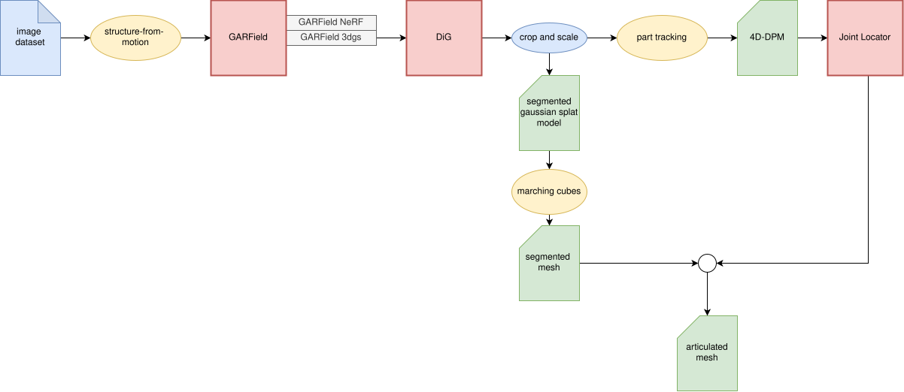

# Real-to-Sim: 3D Reconstruction of Articulated Objects

This repository contains scripts developed for my undergraduate thesis, which build upon GARField, an open-vocabulary pipeline for creating hierarchically segmented NeRF models. This project leverages GARField, Robot See Robot Do, as well as a number of other works in order to perform 3d reconstruction of articulated objects from monocular RGB video. The output is a simulation-ready mesh with recovered revolute joints, suitable for deployment in NVIDIA IsaacSim.

## 🧩 Project Overview

**Goal:** Generate articulated, simulation-ready USD assets from nothing more than a hand-held video.

## 📌 Pipeline Overview

```
Video → Frame Extraction
     → Camera Pose Estimation (COLMAP, nerfstudio implementation)
     → 3DGS Reconstruction (GARField + DiG)
     → Segmentation & Scale Selection
     → 4D Part Tracking (RSRD)
     → Joint Extraction (Least Squares Fit)
     → Mesh Extraction (Marching Cubes)
     → USD Export
```



Each stage is modular. Scripts and tools are provided to:

* Preprocess video into images
* Run SfM and extract camera intrinsics/extrinsics
* Train the Gaussian splat model
* Segment and isolate object parts
* Track articulated parts over time
* Fit revolute joint axes from motion trajectories
* Convert splats into watertight meshes
* Export articulated USD files

## 📂 Directory Structure


```
/scripts
  frame_extraction.py       # Extract frames from video
  run_colmap.py             # Automates COLMAP pipeline
  train_garfield.py         # Launches GARField + DiG training
  segment_gaussians.py      # Performs 3D segmentation on splats
  run_tracker.py            # Optimizes part trajectories (RSRD)
  extract_joint.py          # Least-squares fitting of revolute joints
  splat_to_mesh.py          # Marching Cubes on splat densities
  export_usd.py             # Assembles articulated mesh + joints
```

## 📎 Requirements

* Python 3.10+
* COLMAP
* PyTorch
* Nerfstudio (with 3DGS/DiG support)
* NVIDIA Warp (for tracking)
* Omniverse Kit / IsaacSim (for USD export and validation)

See `requirements.txt` or environment YAML for full dependencies.

## 📌 Status

✅ Proof of concept complete
⚠️ Not yet robust to occlusion or segmentation noise
🚧 Mesh quality can be improved with adaptive surface methods
